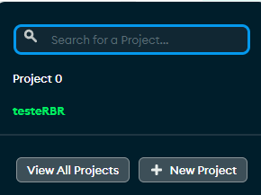
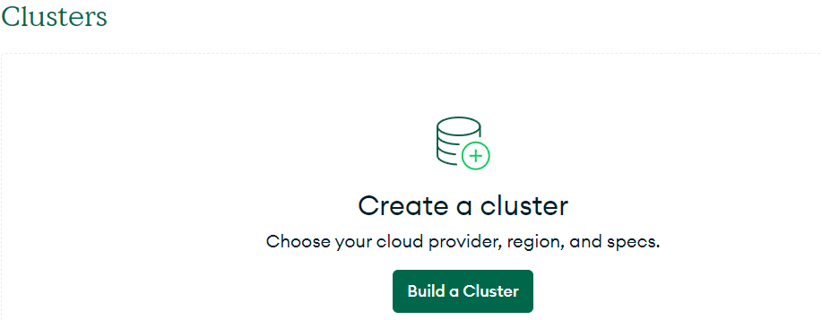
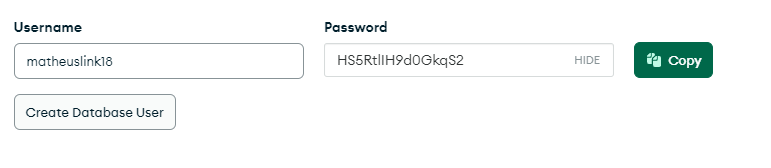
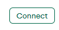
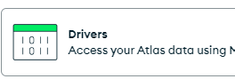
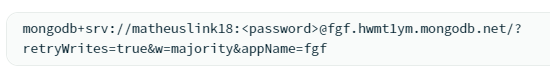
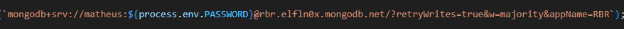

# RBR DIGITAL
## Visão Geral
o RBR Digital é uma aplicação web com o objetivo de demonstração de habilidades com proeficiencia e maestria de um CRUD de funcionários
## Backend
### Tecnologias
The backend of RBR DIGITAL is built using the following technologies:
 - Typescript: um superconjunto de JavaScript digitado estaticamente que melhora a qualidade e a capacidade de manutenção do código.
 - Express: Uma estrutura de aplicativo da web Node.js mínima e flexível que fornece um conjunto robusto de recursos para aplicativos da web e móveis.
 - Mongoose: Uma ferramenta elegante de modelagem de objetos MongoDB projetada para funcionar em um ambiente assíncrono.
 - Node.js: um tempo de execução JavaScript baseado no mecanismo JavaScript V8 do Chrome, usado para criar aplicativos de rede escalonáveis.

### Componentes Chave
 - Configuração do servidor: Configurando e configurando o servidor Express.
 - Desenvolvimento de API: Criação de APIs RESTful para lidar com diversas operações.
 - Integração de banco de dados: usando o Mongoose para interagir com o MongoDB, definindo esquemas e executando operações CRUD.

 ### Estrutura do Projeto
 O projeto está organizado em vários diretórios para separar preocupações e manter uma arquitetura limpa. Abaixo está uma visão geral de alto nível da estrutura de diretórios:

/backend
  ├── /.vscode
  ├── /controllers
  ├── /db
  ├── /models
  ├── /routes
  ├── /utils
  ├── .env.local.ts
  ├── index.ts
  ├── package.json
  ├── RBR.postman_collection.json
  ├── server.ts
  ├── setRoutes.ts
  └── tsconfig.json

### Configuração e Instalação

1. Clone o repositório e entre na pasta do backend:
```git@github.com:tianopo/testeRBR.git```
```cd backend```

2. Instale as dependencias:
```npm install```

3. Copie o arquivo .env.local e o transforme em .env

4. vá no site https://cloud.mongodb.com/ e faça login

5. Crie um novo projeto


6. Crie um banco de dados


7. Salve a senha no seu .env em PASSWORD


8. vá em "Connect" e depois em "Drivers"



9. Copie seu código e cole no arquivo db/conn.ts


10. coloque sua senha como process.env.password onde fica o <password>


11. Rode a aplicação
```npm run dev```

## Frontend
### Tecnologias
O frontend da RBR DIGITAL é desenvolvido utilizando as seguintes tecnologias:
 - Typescript: fornece segurança de tipo e melhora a qualidade do código.
 - React: Uma biblioteca JavaScript para construção de interfaces de usuário, permitindo a criação de componentes de UI reutilizáveis.
 - Next.js: uma estrutura React que permite a renderização do lado do servidor e a geração de sites estáticos para aplicativos da web baseados em React.
 - Chakra UI: uma biblioteca de componentes simples, modular e acessível que fornece todos os blocos de construção necessários para construir seus aplicativos React.

### Componentes Chave
 - Componentes de página: Criação de páginas diferentes para o aplicativo usando Next.js.
 - Componentes de UI: Construindo componentes de UI reutilizáveis com Chakra UI.
 - Gerenciamento de estado: gerenciando o estado do aplicativo usando ganchos e contexto do React.
 - Integração de API: busca e gerenciamento de dados do back-end usando Axios.
 - Roteamento: Implementando roteamento do lado do cliente usando Next.js.
 - Estilo: Personalização e tematização do aplicativo usando as soluções de estilo do Chakra UI.
 - Manipulação de formulários: gerenciamento de formulários e validações de formulários usando bibliotecas como React Hook Form e Yup.

 ### Estrutura do Projeto
 O projeto está organizado em vários diretórios para separar preocupações e manter uma arquitetura limpa. Abaixo está uma visão geral de alto nível da estrutura de diretórios:

/frontend
  ├── /public
  ├── /src
        ├── /@types
        ├── /components
        ├── /config
        ├── /hooks
        ├── /pages
        └── /utils
  ├── next.config.mjs
  ├── package-lock.json
  ├── package.json
  └── tsconfig.json

### Configuração e Instalação

1. Clone o repositório e entre na pasta do frontend:
```git@github.com:tianopo/testeRBR.git```
```cd frontend```

2. Instale as dependencias:
```npm install```

3. Inicie servidor:
```npm run dev```